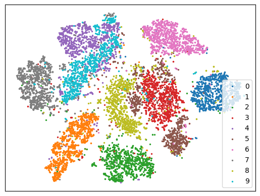

# Machine learning experiments

### Convolution Example  [py](_01_convolution_example.py)

Basic convolution.
Example from https://github.com/pytorch/examples/blob/main/mnist/main.py

```
(conv1): Conv2d(1, 32, kernel_size=(3, 3), stride=(1, 1))
(conv2): Conv2d(32, 64, kernel_size=(3, 3), stride=(1, 1))
(dropout1): Dropout(p=0.25, inplace=False)
(dropout2): Dropout(p=0.5, inplace=False)
(fc1): Linear(in_features=9216, out_features=128, bias=True)
(fc2): Linear(in_features=128, out_features=10, bias=True)
```

### LeNet  [py](_02_convolution_LeNet.py)

[LeNet](https://en.wikipedia.org/wiki/LeNet)-like.

```
(seq): Sequential(
  (0): Conv2d(1, 6, kernel_size=(5, 5), stride=(1, 1), padding=(2, 2))
  (1): LambdaModule()
  (2): AvgPool2d(kernel_size=(2, 2), stride=(2, 2), padding=0)
  (3): Conv2d(6, 16, kernel_size=(5, 5), stride=(1, 1))
  (4): LambdaModule()
  (5): AvgPool2d(kernel_size=(2, 2), stride=(2, 2), padding=0)
  (6): Flatten(start_dim=1, end_dim=-1)
  (7): Linear(in_features=400, out_features=120, bias=True)
  (8): LambdaModule()
  (9): Linear(in_features=120, out_features=84, bias=True)
  (10): LambdaModule()
  (11): Linear(in_features=84, out_features=10, bias=True)
)
```

### Determine topology [nb](_03_determine_topology.ipynb) [py](_03_determine_topology.py)

Infer topology of training data. For MNIST that would be close to a 2D grid.
A single linear layer acts as a correlation matrix.

```
(linear1): Linear(in_features=784, out_features=784, bias=False)
```

### Comparative [nb](_04_comparative.ipynb) [py](_04_comparative.py)

Ask network to determine if two input images are the same. Similar to k-nearest neighbors.

```
(sequence): Sequential(
  (0): Conv2d(2, 32, kernel_size=(3, 3), stride=(1, 1), groups=2)
  (1): ReLU()
  (2): Conv2d(32, 64, kernel_size=(3, 3), stride=(1, 1), groups=2)
  (3): ReLU()
  (4): MaxPool2d(kernel_size=(2, 2), stride=(2, 2), padding=0, dilation=1, ceil_mode=False)
  (5): Dropout2d(p=0.15, inplace=False)
  (6): Flatten(start_dim=1, end_dim=-1)
  (7): Linear(in_features=9216, out_features=128, bias=True)
  (8): ReLU()
  (9): Dropout(p=0.25, inplace=False)
  (10): Linear(in_features=128, out_features=2, bias=True)
)
```

### Self-attention  [py](_05_self_attention.py)

Self-attention at the pixel level.

```
(embedding): Embedding(32, 8)
(positional_embedding): Embedding(196, 8)
(sequence): Sequential(
  (0): MaxPool2d(kernel_size=(2, 2), stride=(2, 2), padding=0, dilation=1, ceil_mode=False)
  (1): Flatten(start_dim=1, end_dim=-1)
  (2): LambdaModule()
  (3): Embedding(32, 8)
  (4): Sequential(
    (0): Residual(
      (network): Sequential(
        (0): LayerNorm((196, 8), eps=1e-05, elementwise_affine=True)
        (1): LambdaModule()
        (2): Parallel(
          (networks): ModuleList(
            (0-1): 2 x SelfAttention(
              (keys): Linear(in_features=8, out_features=8, bias=False)
              (queries): Linear(in_features=8, out_features=8, bias=False)
              (values): Linear(in_features=8, out_features=4, bias=False)
...
```

### Autoencoder [nb](_06_autoencoder.ipynb) [py](_06_autoencoder.py)

Basic autoencoder.

#### t-SNE plot of encoded digits


```
(encode): Sequential(
  (0): Conv2d(1, 4, kernel_size=(2, 2), stride=(2, 2))
  (1): ReLU()
  (2): Conv2d(4, 8, kernel_size=(2, 2), stride=(2, 2))
  (3): ReLU()
  (4): Flatten(start_dim=1, end_dim=-1)
  (5): Linear(in_features=392, out_features=32, bias=True)
)
(decode): Sequential(
  (0): Linear(in_features=32, out_features=392, bias=True)
  (1): ReLU()
  (2): Linear(in_features=392, out_features=784, bias=True)
  (3): LambdaModule()
)
```
