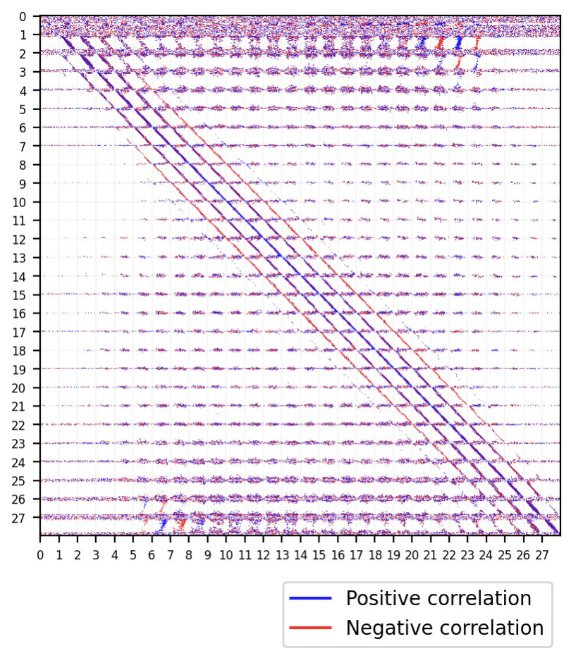

# Machine learning experiments

### Convolution Example  [py](_01_convolution_example.py)

Basic convolution.
Example from https://github.com/pytorch/examples/blob/main/mnist/main.py


### LeNet  [py](_02_convolution_LeNet.py)

[LeNet](https://en.wikipedia.org/wiki/LeNet)-like.

```
(seq): Sequential(
  (0): Conv2d(1, 6, kernel_size=(5, 5), stride=(1, 1), padding=(2, 2))
  (1): LambdaModule(1.7159*torch.tanh(2*x/3))
  (2): AvgPool2d(kernel_size=(2, 2), stride=(2, 2), padding=0)
  (3): Conv2d(6, 16, kernel_size=(5, 5), stride=(1, 1))
  (4): LambdaModule(1.7159*torch.tanh(2*x/3))
  (5): AvgPool2d(kernel_size=(2, 2), stride=(2, 2), padding=0)
  (6): Flatten(start_dim=1, end_dim=-1)
  (7): Linear(in_features=400, out_features=120, bias=True)
  (8): LambdaModule(1.7159*torch.tanh(2*x/3))
  (9): Linear(in_features=120, out_features=84, bias=True)
  (10): LambdaModule(1.7159*torch.tanh(2*x/3))
  (11): Linear(in_features=84, out_features=10, bias=True)
)
```


### Determine topology [nb](_03_determine_topology.ipynb) [py](_03_determine_topology.py)

Infer topology of training data. For MNIST that would be close to a 2D grid.
A single linear layer acts as a correlation matrix.

#### Correlations according to weight matrix


The blue diagonal along the middle means each pixel is strongly correlated with itself. The two red diagonals mean that pixels at a vertical distance of 2 are anticorrelated.

#### Topology based on a threshold


Since this is the "data topology", it doesn't actually match the grid and isn't planar.

```
(linear1): Linear(in_features=784, out_features=784, bias=False)
```


### Comparative [nb](_04_comparative.ipynb) [py](_04_comparative.py)

Ask network to determine if two input images are the same. Similar to k-nearest neighbors.


### Self-attention  [py](_05_self_attention.py)

Self-attention at the pixel level.


### Autoencoder [nb](_06_autoencoder.ipynb) [py](_06_autoencoder.py)

Basic autoencoder.

#### t-SNE plot of encoded digits


```
(encode): Sequential(
  (0): Conv2d(1, 4, kernel_size=(2, 2), stride=(2, 2))
  (1): ReLU()
  (2): Conv2d(4, 8, kernel_size=(2, 2), stride=(2, 2))
  (3): ReLU()
  (4): Flatten(start_dim=1, end_dim=-1)
  (5): Linear(in_features=392, out_features=32, bias=True)
)
(decode): Sequential(
  (0): Linear(in_features=32, out_features=392, bias=True)
  (1): ReLU()
  (2): Linear(in_features=392, out_features=784, bias=True)
  (3): LambdaModule(lambda x: x.reshape(-1, 1, 28, 28))
)
```


### All the activations  [py](_07_all_the_activations.py#L109)

If you're having trouble deciding between activations, just use all of them. Easy.
Includes a skip connection, which can be considered the null activation, very cool.
```python
activation = lambda input_size: Parallel([
    LambdaModule(lambda x: x),
    nn.ReLU(),
    nn.GELU(),
    nn.Sigmoid(),
    nn.LeakyReLU(),
    nn.LogSigmoid(),
    SoftmaxGrouped(group_size=4),
    SoftmaxGrouped(group_size=8, permute_size=input_size),
    Conv1d(4),
    Conv1d(8, permute_size=input_size),
])
```


### Staged networks  [py](_08_staged_networks.py#L123)

First fully train one network on a task. Freeze its weights and attach a new network.
Train the combined network and repeat.

```
(sequence): ExpansionSerial(
  (networks): ModuleList(
    (0): Flatten(start_dim=1, end_dim=-1)
    (1): ExpansionParallel(
      (networks): ModuleList(
        (0-9): 10 x Sequential(
          (0): RandomSample()
          (1): Residual(
            (network): Sequential(
              (0): Linear(in_features=16, out_features=16, bias=True)
              (1): LayerNorm((16,), eps=1e-05, elementwise_affine=True)
              (2): ReLU()
              (3): Dropout(p=0.5, inplace=False)
...
```


### Softfloor [nb](_09_softfloor.ipynb) [py](_09_softfloor.py)

Softfloor function based on sigmoid.


```python
def softfloor_make(factor=1e-4):
    factor = 1 + factor
    equation = sympy.Eq(1, factor*(2 / (1 + sympy.exp(-sympy.symbols("x"))) - 1))
    adjustment = float(sympy.solve(equation)[0])

    def f(xs):
        floor = torch.floor(xs + 0.5)
        xs = xs - floor
        ys = floor + factor*((1 / (1 + torch.exp(-(2*xs)*adjustment))) - 1)

        return ys + 0.5*factor - 0.5

    return f
```

